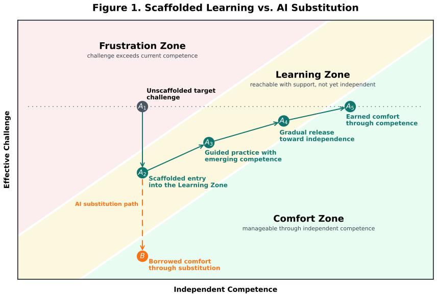

# Pathwise Pedagogy

## Designing the Path of Least Resistance for Learning in the Age of AI

### Purpose

Pathwise Pedagogy is an instructional-design approach for AI-accessible education. It begins from a simple premise: when students have access to AI, they can often produce competent-looking work without developing the competence that the work is meant to demonstrate. The problem is not merely cheating. The deeper problem is that AI weakens the relationship between visible performance and actual learning.

Pathwise Pedagogy responds by designing learning environments in which the easiest successful path still passes through the student's own disciplinary thinking.

This document develops the approach in three layers:

1. A conceptual framework for education in the age of AI.
2. A pedagogical model for designing learning paths.
3. An application to undergraduate Algorithms, including a homework platform and assignment patterns.

This draft focuses on the first layer: the conceptual framework.

## 1. Conceptual Framework

### 1.1 The Traditional Learning Arc

The foundation of Pathwise Pedagogy is the Zone of Proximal Development (ZPD). For instructional design, the ZPD can be understood through three zones:

| Zone | Student Experience | Instructional Meaning |
|---|---|---|
| **Frustration Zone** | I cannot do this yet, even with ordinary support. | The task is currently out of reach. |
| **Learning Zone** | I can do this with support. | The task is within the ZPD; this is where instruction should focus. |
| **Comfort Zone** | I can do this independently. | The skill has become part of the student's independent competence. |

Traditional education tries to move students through these zones. A student begins unable to do some target task. The instructor places the student in the Learning Zone by providing explanation, modeling, feedback, collaboration, worked examples, hints, or other forms of scaffolding. Over time, that support is faded. What the student could once do only with help becomes something the student can do independently.

In this model, the goal is not permanent struggle. The goal is earned comfort: the ease that comes from competence.

### 1.2 The Pre-AI Assumption: Comfort as Evidence of Independence

Before widely available AI, classroom performance was never a perfect measure of student competence, but it was often a usable signal. If a student produced a correct proof, program, analysis, explanation, or design, the instructor could often infer that the student had done at least some of the intended thinking.

In that environment, the Comfort Zone roughly aligned with the Independent Zone:

- The student could do the work.
- The student felt increasingly comfortable doing the work.
- The submitted performance gave some evidence of the student's independent competence.

Education and work were also more closely aligned. The difference between "what I cannot do" and "what I can do" in the classroom resembled the difference between "what I cannot do" and "what I can do" in professional practice. The educational task was to help students move from incapacity, through supported practice, into independent capability.

AI changes this relationship.

### 1.3 The AI Disruption: Comfort Without Competence

AI can produce competent-looking work on behalf of the student. This creates a new possibility: a student may feel comfortable completing a task not because they can do it independently, but because they can depend on AI to do much of the work.

This is borrowed comfort.

Borrowed comfort feels like mastery from the inside. The student has a working answer, polished language, plausible code, or a coherent-looking explanation. The assignment is complete. The anxiety has dropped. But the comfort may come from dependence rather than competence.

This creates two illusions:

- **The student-side illusion:** "I can do this," when the more accurate statement is, "I can get AI to produce this."
- **The instructor-side illusion:** "The student can do this," when the more accurate statement is, "The student submitted work that looks like someone competent did this."

The result is performative competence: a product that resembles mastery without reliably showing whether mastery exists.

Pathwise Pedagogy is built to address this disruption.

Figure 1 represents each point as a learner-task state: a particular student encountering a target task under particular support conditions. The horizontal axis is **independent competence**. Movement to the right means the student can do more of this kind of work without help. The vertical axis is **effective challenge**. This is not the task's objective difficulty in isolation; it is the challenge the task presents to the student under the current conditions of support, scaffolding, tool use, and independence. Scaffolding can lower effective challenge without immediately increasing competence. Fading support can raise effective challenge while competence increases. AI substitution can lower the apparent challenge of completion without increasing competence.

The zones are defined by the relationship between competence and effective challenge. When challenge is low relative to competence, the student is in the Comfort Zone. When challenge is calibrated just beyond independent competence, the student is in the Learning Zone. When challenge is too high relative to competence, the student is in the Frustration Zone.

The green path shows the intended learning trajectory. At **A1**, the unaided target task is too challenging for the student's current competence. At **A2**, scaffolding lowers the effective challenge enough for productive struggle to begin inside the Learning Zone. From **A2** through **A5**, support is gradually faded while competence increases. By **A5**, the student has reached earned comfort: the task can be handled with independence because competence has grown. The orange dotted bypass shows the AI disruption. From **A2**, AI can create a shortcut to **B**, borrowed comfort, where completion feels easier but independent competence has not increased.

### 1.4 The Central Question: Scaffold or Substitute?

AI is not inherently harmful to learning. The key question is whether AI is functioning as a scaffold or as a substitute.

**AI as scaffold** helps the student work inside the Learning Zone. It may explain a concept, ask guiding questions, help interpret feedback, suggest a test case, identify a bug pattern, or model a partial strategy. The student still has to engage the disciplinary substance of the task. AI support helps the student do what they are close to being able to do.

**AI as substitute** performs the target thinking in place of the student. It writes the proof, produces the algorithm, explains the runtime, summarizes the reading, or generates the critique in a way that lets the student bypass the intended learning work. 

The same tool can play either role. The difference is not the technology itself. The difference is the design of the task, the surrounding supports, the expected evidence, and the path of least resistance.

The central design question is therefore:

> Does the assignment make AI function as a scaffold for learning, or as a substitute for learning?

### 1.5 Path of Least Resistance

Students do not choose paths through assignments randomly. They tend to choose the path that feels cheapest relative to the goal they believe they are being asked to satisfy. That cost may include time, effort, uncertainty, cognitive load, anxiety, grade risk, tool friction, and social expectations.

Pathwise Pedagogy calls this the path of least resistance.

In an AI-accessible environment, the path of least resistance may no longer pass through the student's own learning. A student can sometimes move directly from confusion to submission by routing the task through AI. The submitted work may look like Comfort Zone performance, even when the student never moved through the Learning Zone.

The instructional-design problem is to shape the available paths so that the easiest successful route still requires the student to do the intended cognitive work.

This does not mean every assignment should make AI hard to use. Sometimes the intended work is algorithm synthesis, proof construction, or independent analysis. In those cases, AI must not be allowed to substitute for the central act of learning. Other times the intended work is specification, critique, verification, comparison, or tool-mediated judgment. In those cases, AI use may be part of the intended path.

The key is not whether AI is present. The key is whether the path of least resistance passes through learning.

### 1.6 Cognitive Load: Why Paths Feel Cheap or Costly

Cognitive Load Theory helps explain why students choose one path rather than another. A path feels costly when it demands too much working memory, too much uncertainty, or too much effort unrelated to the target learning.

For this framework, three forms of load matter:

| Load Type | Meaning | Design Implication |
|---|---|---|
| **Intrinsic load** | The inherent difficulty of the material for this learner, given their current schemas. | Managed mainly through sequencing, prerequisites, and task selection. |
| **Extraneous load** | Effort that does not contribute to the learning goal. | Usually reduced on the intended learning path. |
| **Germane load** | Effort that contributes to schema construction and transferable understanding. | Preserved at a productive level. |

The Learning Zone is not the absence of difficulty. It is the presence of the right difficulty. If intrinsic load is too low, the student remains in the Comfort Zone and learns little. If intrinsic load is too high, the student enters the Frustration Zone and may disengage or outsource. If extraneous load is too high, the student may spend their effort on the wrong thing. If germane load is removed, the student may complete the task without building the intended competence.

AI intensifies these tradeoffs because it offers a way to reduce felt load without necessarily producing learning. The student can lower the effort of completion by handing the task to AI. Pathwise design therefore asks not only "How hard is this task?" but "Where does the difficulty live, and whose thinking does it require?"

### 1.7 Productive Struggle, Productive Resistance, and Path-Shaping Friction

Productive struggle is the learner's effortful engagement with a task that is challenging but reachable. It belongs in the Learning Zone. It is productive because the struggle is directed at the target concept or practice, not at irrelevant obstacles.

Pathwise Pedagogy preserves productive struggle through careful design of friction. But not all friction is the same.

**Productive resistance** is friction on the intended learning path that sustains useful thinking. It prevents the task from becoming so scaffolded, procedural, or automated that students no longer have to reason. For example, an Algorithms assignment may provide priority-queue boilerplate to remove irrelevant coding burden while withholding the key recurrence, invariant, or correctness argument that students must construct themselves.

**Path-shaping friction** is friction that prevents students from bypassing the learning goal. It acts on routes that would produce a correct-looking submission without the intended thinking. For example, student-specific inputs, evidence-bound traces, oral checks, or critique requirements can make it harder to submit AI-generated work without understanding it.

This distinction matters. Extra difficulty is not automatically educational. Friction is valuable only when it either sustains productive struggle on the intended path or prevents a bypass path from replacing the intended learning.

### 1.8 Borrowed Comfort and Earned Comfort

The goal of Pathwise Pedagogy is not to keep students uncomfortable. The goal is to create earned comfort.

| Type of Comfort | Source | Educational Status |
|---|---|---|
| **Borrowed comfort** | The student feels capable because AI can produce or polish the answer. | Risky when it hides dependence. |
| **Earned comfort** | The student feels capable because they can perform the work independently. | The desired outcome of learning. |

AI can be part of the movement toward earned comfort when it functions as scaffold. It becomes a problem when it lets students settle into borrowed comfort while appearing independently competent.

This is why Pathwise Pedagogy does not simply ask, "Did the student use AI?" It asks:

> Did AI help the student move toward independence, or did it make dependence look like independence?

### 1.9 Evidence of Competence

Because AI can produce polished outputs, final products are no longer enough. Assignments must ask for evidence that is harder to fake without doing the relevant thinking.

Evidence of competence may include:

- intermediate reasoning,
- traces of decisions,
- student-specific examples,
- error analysis,
- counterexamples,
- tests and interpretations,
- oral explanation,
- revision history,
- comparison between AI output and student evidence,
- transfer to a nearby but non-identical problem.

The point is not surveillance for its own sake. The point is alignment: the evidence required for completion should reveal whether the student is moving from supported performance toward independent competence.

### 1.10 The Core Claim

Pathwise Pedagogy can be summarized in one sentence:

> In the age of AI, instructors must design the path of least resistance so that successful completion still moves students from borrowed comfort, through productive struggle, toward earned comfort.

Or, more formally:

> Pathwise Pedagogy designs AI-accessible learning environments so that AI can serve as scaffold inside the Learning Zone without becoming a substitute for the student's movement into independent competence.

## 2. Pedagogical Model

The pedagogical model is simple: make the intended learning path more accessible, and make the AI bypass less sufficient.

Pathwise Pedagogy does not try to remove AI from the learning environment. It designs the path of least resistance so that successful completion remains coupled to competence. The instructor works on two paths at once: the green path toward earned comfort, and the AI-bypass path toward borrowed comfort.

### 2.1 Support the Intended Learning Path

The first move is traditional scaffolding. The instructor lowers effective challenge enough to move students from the Frustration Zone into the Learning Zone. This does not mean removing the intellectual work. It means removing or reducing the barriers that prevent students from beginning the work.

On the intended path, scaffolding should:

- reduce extraneous load,
- make the task reachable,
- preserve the target thinking,
- create conditions for productive struggle,
- fade as competence increases.

This is the green path in Figure 1. Students begin with an unaided target task that is too challenging. Scaffolding brings the task into the Learning Zone. Productive struggle begins. Support is gradually released. The endpoint is earned comfort: the student can perform the target competence with increasing independence.

This path may include AI. AI functions as scaffold when it helps students stay in the Learning Zone while leaving the target thinking to the student.

### 2.2 Protect Against the AI Bypass

The second move is path-shaping friction. AI can create a bypass route: the student can produce a competent-looking answer without developing the competence the assignment is meant to build. This is borrowed comfort.

Path-shaping friction makes the bypass route less attractive, less reliable, or less sufficient. It does not add difficulty for its own sake. It changes the assignment so that completion without thinking is harder than completion through the intended learning path.

Path-shaping friction may include:

- student-specific inputs,
- required traces or intermediate reasoning,
- evidence-bound verification,
- critique of AI output against concrete evidence,
- in-class extensions or oral checks,
- transfer to a nearby but non-identical problem.

The goal is not surveillance. The goal is to make competence visible. If AI is used, the student should still have to specify, evaluate, verify, adapt, or explain in ways that require disciplinary understanding.

### 2.3 Preserve Productive Struggle

Scaffolding and path-shaping friction work together. Scaffolding lowers effective challenge on the intended path; path-shaping friction prevents the bypass path from becoming easier than learning.

Between those two moves sits productive struggle. Productive struggle is the learner's effortful engagement with a reachable challenge. It is not confusion, busywork, or punishment. It is the cognitive work that moves a student from supported performance toward independent competence.

Productive resistance is the design choice that preserves this struggle. The instructor withholds just enough completion support to keep the student reasoning, while still providing enough scaffold to keep the task inside the Learning Zone.

### 2.4 Design Cycle

The model can be used as a compact design cycle:

1. **Name the target competence.** What should students become able to do?
2. **Place the task in the Learning Zone.** What scaffold is needed to make productive struggle possible?
3. **Preserve the target thinking.** What support would accidentally do the work for the student?
4. **Identify the AI bypass.** How could AI produce completion without competence?
5. **Add path-shaping friction.** What evidence or task structure keeps completion tied to understanding?
6. **Fade support.** What can be removed as students move toward earned comfort?

The cycle is not anti-AI. It is anti-illusion. AI is welcome when it functions as scaffold. It is dangerous when it turns dependence into the appearance of independence.

## 3. Application to Algorithms

_To be drafted after the pedagogical model section._
